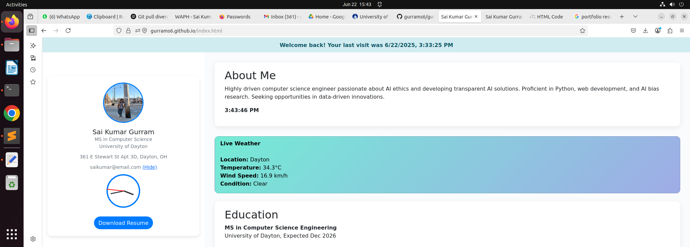
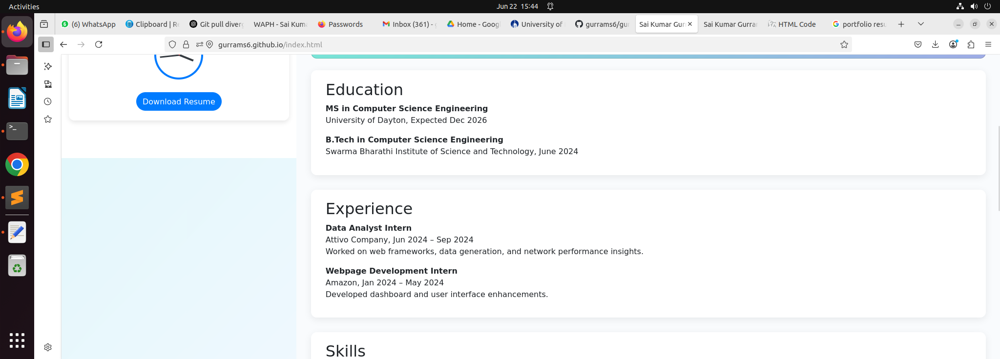
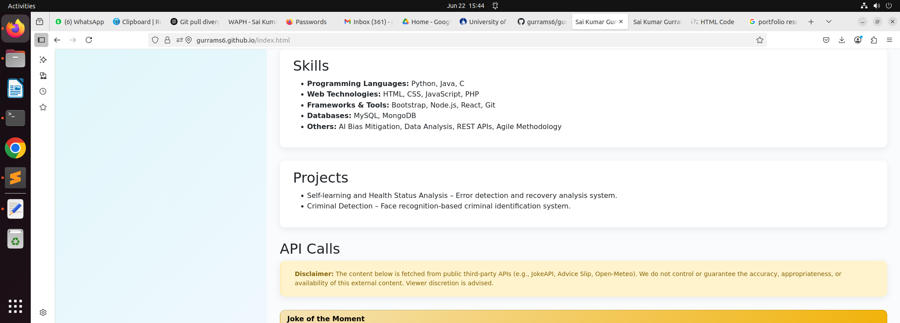
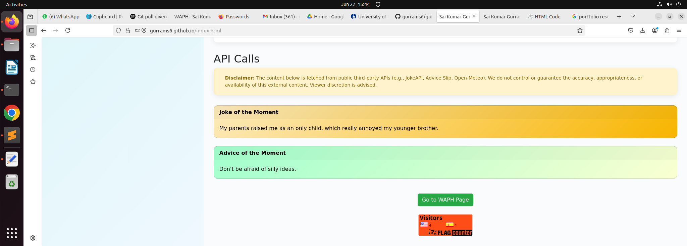
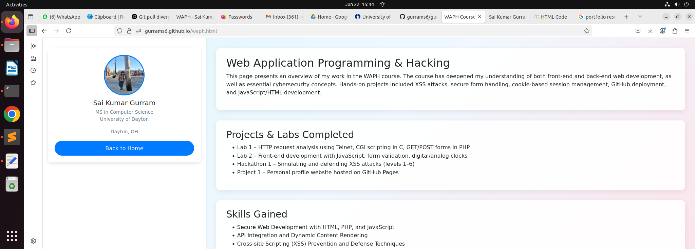
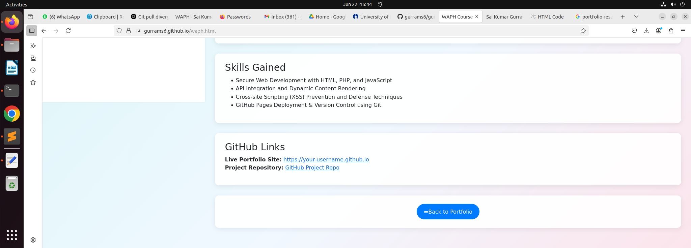

# WAPH - Web Application Programming and Hacking  
## Lab 2 - Front-end Web Development  
**Instructor:** Dr. Phu Phung  
**Student:** Sai Kumar Gurrams6
**Email:** gurrams6@udayton.edu  

---

## Overview

This project involved building a professional portfolio website using HTML, CSS (Bootstrap), and JavaScript, then deploying it on GitHub Pages. The website showcases my academic background, technical experience, and skill set, while also demonstrating modern web development features. I integrated real-time APIs (Joke API, Weather API, XKCD Comic API), implemented user interaction using JavaScript and jQuery, and tracked user visits using cookies. Additionally, the site includes a dedicated WAPH page describing the course projects and skills gained.

**Live Portfolio:** [https://gurrams6.github.io/](https://gurrams6.github.io/)  
**GitHub Repository:** [https://github.com/gurrams6/gurrams6.github.io](https://github.com/gurrams6/gurrams6.github.io)

---

## Tasks and Subtasks

### General Requirements

- Created a professional profile page with:
  - Name, Headshot (150x150), Contact Info
  - Education and Experience sections
  - Projects and Skills listing
- Linked to a separate WAPH course page via a styled button

### Non-Technical Requirements

- Used Bootstrap for consistent responsive design and styling.
- The profile is professional and suitable for employers.
- Added a **Flag Counter** to track global visitors.

### Technical Requirements

#### 1. JavaScript Functionality

- **Digital Clock**: Shows current time and updates every second.
- **Analog Clock**: Displayed on the sidebar using rotating divs for hour, minute, and second hands.
- **Show/Hide Email**: Button toggles email visibility.
- **Visit Tracker (Cookies)**: Tracks and displays last visit or a first-time message.

#### 2. Web API Integrations

- **Joke API**: Fetches a random joke every 60 seconds from [JokeAPI](https://v2.jokeapi.dev/).
- **Advice API**: Displays a new piece of advice every 60 seconds from [Advice Slip API](https://api.adviceslip.com/advice).
- **Weather API**: Uses Open-Meteo to fetch current weather based on geolocation.
- **XKCD Comic API**: Displays latest comic using a CORS proxy (AllOrigins).

#### 3. Cookie Handling

- Displays:  
  - `"Welcome to my homepage for the first time!"` for new visitors  
  - `"Welcome back! Your last visit was <date/time>"` for returning users  
- Cookie updates on each visit

#### 4. WAPH Page

- Separate page (`waph.html`) summarizes:
  - Labs completed
  - Hackathon and project tasks
  - Skills gained (XSS, JS, GitHub, deployment)

---

## Screenshots

  
**Index page**

  

  

  
**api calls**

  

**waph page**

---

## Conclusion

This project gave me hands-on experience in responsive web design, JavaScript interactivity, API consumption, and deploying modern websites on GitHub. I also learned how to manage client-side cookies, interact with the DOM, and responsibly display external content.

---

## Submission Links

- **GitHub Pages Site**: [https://gurrams6.github.io/](https://gurrams6.github.io/)  
- **GitHub Repo**: [https://github.com/gurrams6/gurrams6.github.io](https://github.com/gurrams6/gurrams6.github.io)

